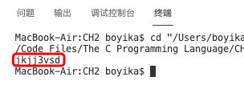
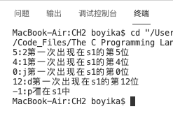

# C程序设计语言（第2版）-课后练习

## 前言：

代码都是在VS CODE上亲测有效的，此处不提供代码文件，有需要可自行拷贝测试。

## CH01 导言

**概述：** 第1章内容主要是通过将一些重要的概念拉出来，让大家了解什么是C语言，以及它能够干什么，里面也附有一些习题，对零基础人员来说有点难度，建议第一遍学习时看一下就行，先把后面的学习完后有时间可以在过来过一遍。


## CH02 类型、运算符与表达式

### 练习2-1

```c
/*
1.打印标准头中的相应值
*/
#include <stdio.h>
#include<limits.h>

int main()
{
    /*各数据类型取值范围*/
    /*signed types*/
    printf("signed char ：%d~%d\n",SCHAR_MIN,CHAR_MAX);
    printf("signed int ：%d~%d\n",INT_MIN,INT_MAX);
    printf("signed short ：%d~%d\n",SHRT_MIN,SHRT_MAX);
    printf("signed long ：%ld~%ld\n",LONG_MIN,LONG_MAX);

    /*unsigned types*/
    printf("unsigned char ：0~%u\n",UCHAR_MAX);
    printf("unsigned int max ：0~%u\n",UINT_MAX);
    printf("unsigned short max ：0~%u\n",USHRT_MAX);
    printf("unsigned long max ：0~%lu\n",ULONG_MAX);
}
```


```c
/*
2.直接计算
*/
#include <stdio.h>

int main()
{
    /*各数据类型取值范围*/
    
    int cMIN = -((unsigned char)~0>>1)-1;
    int cMax = -cMIN-1;
    printf("signed char ：%d ~ %d\n",cMIN,cMax);
    printf("unsigned char ：0 ~ %u\n",(unsigned char)-1);

    int iMIN = -((unsigned int)~0>>1)-1;
    int iMax = -iMIN-1;
    printf("signed int ：%d ~ %d\n",iMIN,iMax);
    printf("unsigned int ：0 ~ %u\n",(unsigned int)-1);

    int sMIN = -((unsigned short)~0>>1)-1;
    int sMax = -sMIN-1;
    printf("signed short ：%d ~ %d\n",sMIN,sMax);
    printf("unsigned short ：0 ~ %u\n",(unsigned short)-1);

    long lMIN = -((unsigned long)~0>>1)-1;
    long lMax = -lMIN-1;
    printf("signed long ：%ld ~ %ld\n",lMIN,lMax);
    printf("unsigned long ：0 ~ %lu\n",(unsigned long)-1); 
}
/*
(unsigned char) ~0 >> 1  是什么意思？

第一步：先是把数字0的各个二进制位全部转换为1；

第二步：然后，将结果值转换为unsigned char 类型 ；

第三步：然后右移一位。             


0默认为int型，占用4个字节，存储为0x00000000，~0的存储值为0xffffffff

sizeof(int) >= 2, sizeof(unsigned char) = 1
转换为unsigned char后存储为0xff，其值为255
>>1就是除以2，存储为0111 1111, 所以为255/2 = 127

所以(unsigned char)~0为ff（无符号），再右移一位为7f（即127）
*/
```


### 练习2-2

```c
/*
for (i=0 ; i<lim-1 && (c=getchar()) != '\n' && c!=EOF ; ++i)  没有&&和||的等价程序
*/

    enum loop{NO,YES};
    enum loop okloop = YES;
    
    i = 0;
    
    while (okloop == YES)
    {
        if (i>=lim-1)
            okloop = NO;
        else if((c=getchar())=='\n')
            okloop = NO;
        else if(c==EOF)
            okloop = NO;
        else
        {
            s[i] = c;
            ++i;
        }   
        
    }
```

### 练习2-3


### 练习2-4

```c
#include <stdio.h>
#include <string.h>
void squeeze(char str1[],char str2[]);

int main()
{
    char s1[] = "jkjj1232cvs2d";
    char s2[] = "2cbm1";
    squeeze(s1,s2);
    printf("%s\n",s1);
}

void squeeze(char str1[],char str2[])
{
    int i,j,k;
    for ( i=k=0 ; str1[i]!='\0' ; i++ )
    {
        for( j=0 ; str2[j]!='\0' && str2[j]!=str1[i] ; j++ )
            ;
        if (str2[j]=='\0')
            str1[k++]=str1[i];
    }
    str1[k] = '\0';
}
```



### 练习2-5

```c
#include <stdio.h>
#include <string.h>
void any(char str1[],char str2[]);

int main()
{
    char s1[] = "jkjj1232cvs2d";
    char s2[] = "21jdp";
    any(s1,s2);
}

void any(char str1[],char str2[])
{
    int i,j;
    for ( i=0 ; str2[i]!='\0' ; i++ )
    {
        for( j=0 ;   ; j++ )
            if (str2[i]==str1[j])
                {
                    printf("%d:%c第一次出现在s1的第%d位\n",j,str2[i],j);
                    break;
                }
            else if(str1[j]=='\0')
                {
                    printf("-1:%c不在s1中\n",str2[i]);
                    break;
                }
    }
}
```



## CH03 控制流


## CH04 函数与程序结构


## CH05 指针与数组


## CH06 结构


## CH07 输入与输出


## CH08 UNIX系统接口


